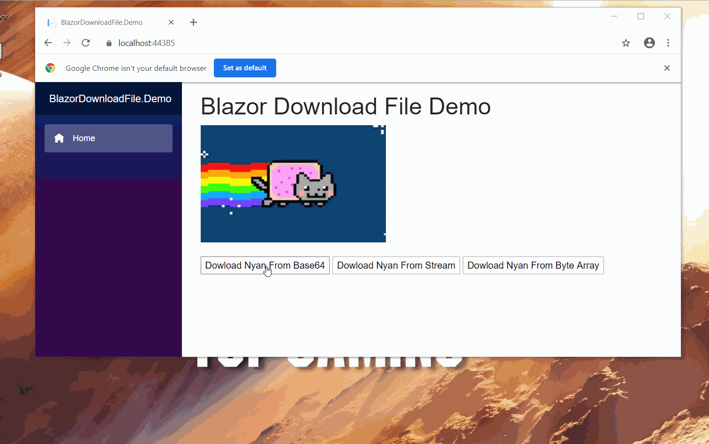

# BlazorDownloadFile

<p>
	<a href="https://www.nuget.org/packages/BlazorDownloadFile">
	    
	</a>
	<a href="https://www.paypal.com/cgi-bin/webscr?cmd=_s-xclick&hosted_button_id=RSE2NMEG3F7QU&source=url">
	    
	</a>
</p>



Blazor download files to the browser from c# without any JavaScript library or dependency.

## Installation

`Install-Package BlazorDownloadFile -Version 2.0.0`

## Register the service in your services method

`services.AddBlazorDownloadFile();`

## No javascript library reference dependency

Since version 1.0.6. 

Please upgrade to latest version if you are using older versions.

## Usage

`[Inject] IBlazorDownloadFileService BlazorDownloadFileService { get; set; }`

### BlazorDownloadFileService Methods

```
ValueTask DownloadFile(string fileName, string bytesBase64, string contentType = "application/octet-stream");
ValueTask DownloadFile(string fileName, string bytesBase64, CancellationToken cancellationToken, string contentType = "application/octet-stream");
ValueTask DownloadFile(string fileName, string bytesBase64, TimeSpan timeOut, string contentType = "application/octet-stream");
ValueTask DownloadFile(string fileName, byte[] bytes, string contentType = "application/octet-stream");
ValueTask DownloadFile(string fileName, byte[] bytes, CancellationToken cancellationToken, string contentType = "application/octet-stream");
ValueTask DownloadFile(string fileName, byte[] bytes, TimeSpan timeOut, string contentType = "application/octet-stream");
ValueTask DownloadFile(string fileName, Stream stream, string contentType = "application/octet-stream");
ValueTask DownloadFile(string fileName, Stream stream, CancellationToken cancellationTokenBytesRead, CancellationToken cancellationTokenJavaScriptInterop, string contentType = "application/octet-stream");
ValueTask DownloadFile(string fileName, Stream stream, CancellationToken cancellationTokenBytesRead, TimeSpan timeOutJavaScriptInterop, string contentType = "application/octet-stream");
ValueTask DownloadFileFromText(string fileName, string plainText, string contentType = "text/plain");
ValueTask DownloadFileFromText(string fileName, string plainText, CancellationToken cancellationToken, string contentType = "text/plain");
ValueTask DownloadFileFromText(string fileName, string plainText, TimeSpan timeOut, string contentType = "text/plain");
ValueTask DownloadFile(string fileName, string bytesBase64, int bufferSize = 32768, string contentType = "application/octet-stream");
ValueTask DownloadFile(string fileName, string bytesBase64, CancellationToken cancellationToken, int bufferSize = 32768, string contentType = "application/octet-stream");
ValueTask DownloadFile(string fileName, string bytesBase64, TimeSpan timeOut, int bufferSize = 32768, string contentType = "application/octet-stream");
ValueTask DownloadFile(string fileName, byte[] bytes, int bufferSize = 32768, string contentType = "application/octet-stream");
ValueTask DownloadFile(string fileName, byte[] bytes, CancellationToken cancellationToken, int bufferSize = 32768, string contentType = "application/octet-stream");
ValueTask DownloadFile(string fileName, byte[] bytes, TimeSpan timeOut, int bufferSize = 32768, string contentType = "application/octet-stream");
ValueTask DownloadFile(string fileName, Stream stream, int bufferSize = 32768, string contentType = "application/octet-stream");
ValueTask DownloadFile(string fileName, Stream stream, CancellationToken cancellationTokenBytesRead, CancellationToken cancellationTokenJavaScriptInterop, int bufferSize = 32768, string contentType = "application/octet-stream");
ValueTask DownloadFile(string fileName, Stream stream, CancellationToken cancellationTokenBytesRead, TimeSpan timeOutJavaScriptInterop, int bufferSize = 32768, string contentType = "application/octet-stream");
ValueTask DownloadFileFromText(string fileName, string plainText, int bufferSize = 32768, string contentType = "text/plain");
ValueTask DownloadFileFromText(string fileName, string plainText, CancellationToken cancellationToken, int bufferSize = 32768, string contentType = "text/plain");
ValueTask DownloadFileFromText(string fileName, string plainText, TimeSpan timeOut, int bufferSize = 32768, string contentType = "text/plain");
```

### Performance Considerations and Understandings

Regarding on some performance test I have done in this library is that, `base64` string and `byte[]` performs faster than `Stream` always. 

Since there is not direct conversion between from c# `Stream` to a JavaScript object its a little more expensive this task. 

When its `base64` this is the most simple data type to transfer and work with it. 

`Byte[]` gets transformed into `base64` string when transfered to JavaScript and for some reason it won't work properly when encoding cause its `base64` representation turns to be something else when going after the second partition when gets encoded to `base64` string. (If anyone knows how to fix or workaround this make a pull request) 

Based on the las sentence, a list of bytes gets passed down from c#  to JavaScript as an array of intergers with the bytes representation on JavaScript and this is the reason why I send a `IList<byte>` rather than `byte[]` internally to JavaScript. 

The binary representation seems to perform very well since we just needed to call `Uint8Array` and push the binary representation entirely into the array to then pass it down to the JavaScript native `Blob` object. 

<b>Take note that you may use the overload methods with buffers if you are sending big files over the wire.</b>

<b>Take note also that blazor server side uses [Signal R](https://docs.microsoft.com/en-us/aspnet/core/signalr/security?view=aspnetcore-3.1#buffer-management) and has its data transfer (buffer) limitations.</b>

## License
MIT
